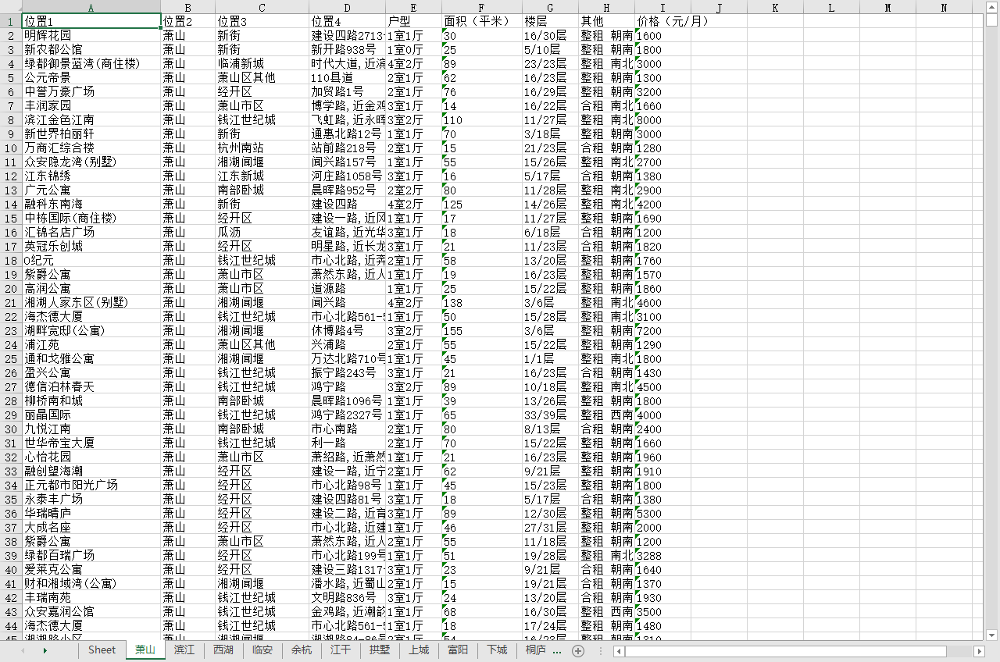
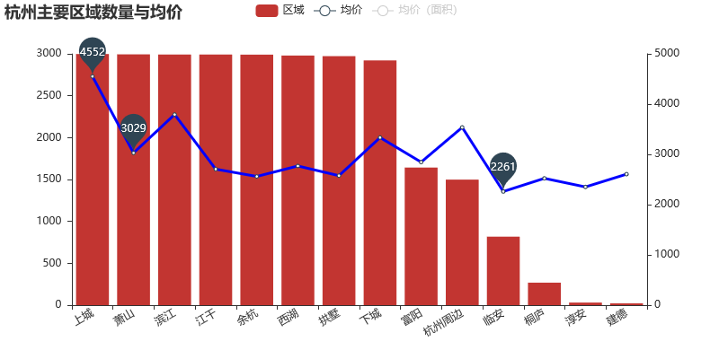
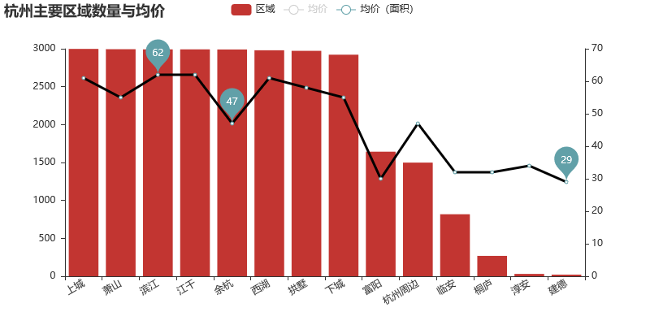
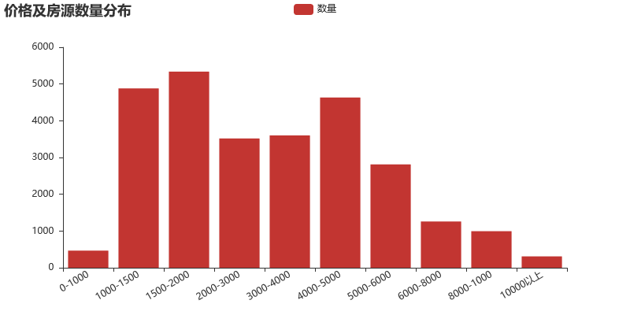
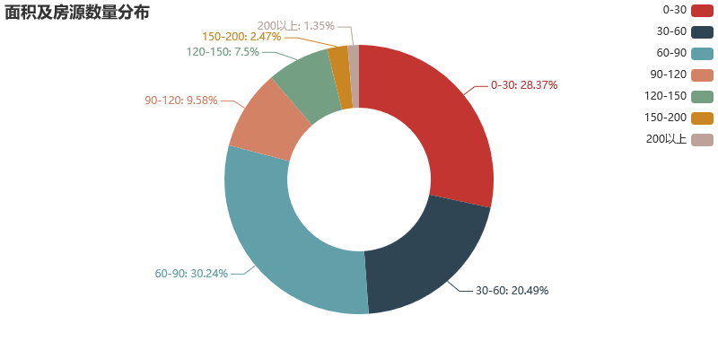
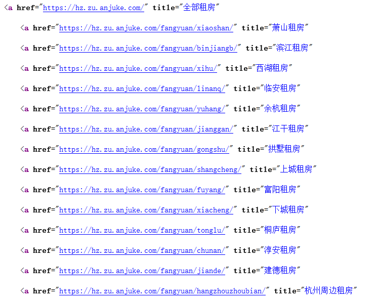
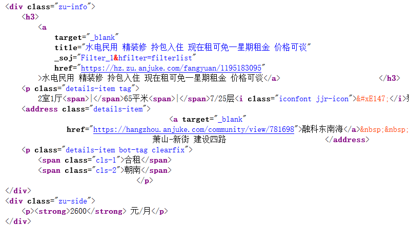
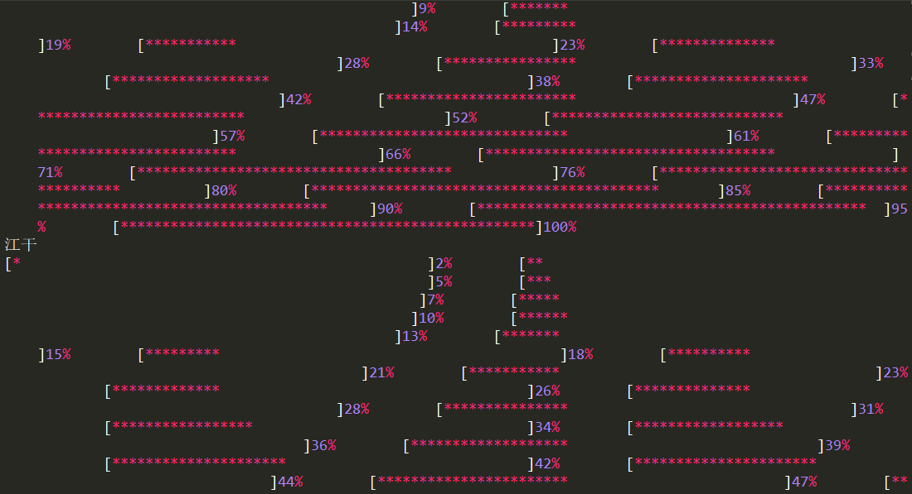
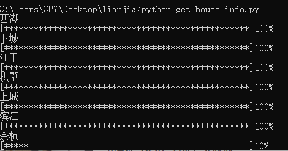

# House_Ranting
爬取链家，安居客租房信息  

## 抓取到的信息保存为xlsx

## 以下为安居客上的信息，以杭州为例
网上的信息不一定准确，主要用来学习娱乐
### 主要区域房子的数量及均价
**均价**

**单位面积均价**

### 价格及房源数量

 

### 面积及房源数量分布

### 户型分布

 
果然还是小户型居多，找小伙伴合租

## 代码
### 数据抓取
**选择城市（杭州）**  
右键源代码，可以找到各区域的链接

   
提取出区域及链接  

    response = etree.HTML(requests.get(url, headers=HEADERS).text)
    areas = response.xpath('//div[@class="sub-items sub-level1"]/a/text()')[1:]
    areas_link = response.xpath('//div[@class="sub-items sub-level1"]/a/@href')[1:]
    
**提取信息**  
在区域信息界面中找到有效信息

  
提取信息

    items = response.xpath('//div[@class="zu-itemmod  "]')
    for item in items:
        detail = item.xpath('.//p[@class="details-item tag"]/text()')
        room_type = detail[0].split()[0]
        area = detail[1][:-2]
        floor = detail[2]
        address_1, address_2, address_3, address_4 = None, None, None, None
        address = item.xpath('.//address[@class="details-item"]//text()')
        try:
            address_1 = address[1]
        except:
            pass
        address = address[-1].split()
        try:
            address_2 = address[0].split('-')[0]
            address_3 = address[0].split('-')[1]
        except:
            pass
        try:
            address_4 = address[1]
        except:
            pass
        detail_2 = item.xpath('.//p[@class="details-item bot-tag clearfix"]//text()')
        other = ' '.join(detail_2[1::2])
        price = item.xpath('.//div[@class="zu-side"]/p/strong/text()')[0]

## 其他
在抓取数据过程中爬链家有明确的页数，可使用进度条的方式  

    def progress_bar(num, total):
        rate = int(100*num/total)
        print('[{}{}]{}%        '.format('*'*int(rate/2), ' '*int((100-rate)/2), rate), end='\r')
但在sublime中不能实现，如下

而在cmd命令行中可以实现

